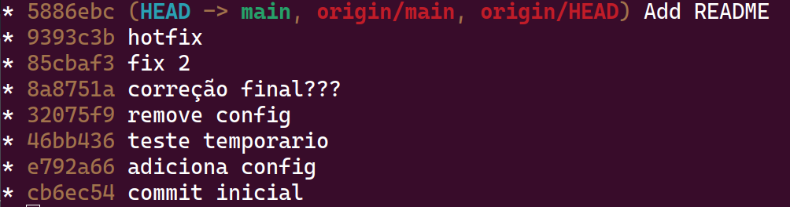
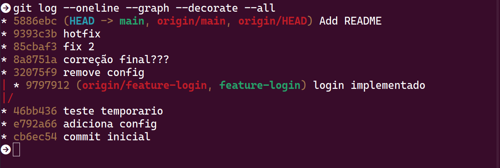
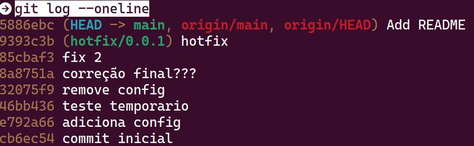
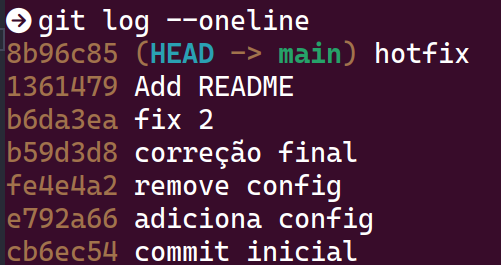

# Passo a Passo

## O commit "login implementado" deveria estar branch feature-login. Crie a branch e remova apenas esse commit da main

1. git log --oneline - Verifica as branchs criadas e seus respectivos ids

2. git checkout -b feature-login 9797912 - De um checkout criando a feature-login a partir do id do login implementado

3. git checkout main - Para voltar para a branch main

4. git rebase -i 46bb436 - De um rebase na commit anterior para conseguir dar um drop no commit errado

5. git log --oneline --graph - Para visualizar como esta o estado atual da origin/main

6. git log --oneline --graph --decorate --all - Com esse comando é possível visualizar que ainda esta presente o commit antigo na nossa arvore, porém não esta presente na branch main como o anterior sinaliza.

##  A hotfix foi feita direto na main, crie uma branch seguindo as boas práticas do gitflow e depois coloque o commit na main. Após crie a release e tag para produção

1. git log - Direto da main para identificar a hash da hotfix

2. git checkout -b hotfix/0.0.1 9393c3ba8d8f6d73d201a549750fb886a785a7d9 - Criando a hotfix

3. git checkout main - Para retornar para a branch principal

4. git log --oneline - Verifica de novo onde esta localizada a branch que devemos alterar. Como ela esta localizada no segundo commit debaixo pra cima conseguimos usar o comando do HEAD

5. git rebase -i HEAD~2 - Abre a rebase interativa e adicione um drop no lugar do pick no commit

6. git merge hotfix/0.0.1 - Para dar um merge da main com a hotfix/0.0.1 que criamos

7. git tag -a v0.0.1 -m "Release v0.0.1" - crie a tag v0.0.1

8. git tag - Verificar se a tag foi criada

9 git push --force origin main - Force o push para a main das alterações

10. git push -u origin hotfix/0.0.1 - Suba a hotfix

11. git push origin v0.0.1 - Suba a tag

## Existe um commit chamado "teste temporario" ele não deveria existir

1. git checkout -b  backup-antes-remover-teste-temporario - Backup de segurança caso quebramos algo, pois o teste temporario esta no meio dos commits. Lembre de voltar para a main

2. git rebase -i e792a66 - rebase no commit anterior ao teste temporario, de um drop no commit do teste e depois feche. Irá dar conflito ai vao ser necessario resolver.

3. git status - para visualizar os conflitos

4. Abra o arquivo que deu conflito (app.js) e resolva eles

5. git add app.js - Adicione o app.js

6. git rebase --continue - Continua a rebase

7. Caso de erro (vai dar) repita o processo 3 a 6 novamente ate dar a mensagem de sucesso

8. git push --force origin main

## Existe um commit com a mensagem "correção final???". Altere a mensagem para "correção final"

1. git rebase -i fe4e4a2 - commit anterior do que vamos alterar

2. reword e87ad00 correção final??? - Mude a linha do commit para o comando anterior

3. Remova os ??? na proxima tela que vai abrir

4. git log --oneline - valide se foi feito corretamente

## Um arquivo chamado "config.js" foi perdido. Recupere esse arquivo sem reverter todo o commit.

1. git log --oneline - para encontrar o commit

2. git restore --source=e792a66 -- config.js - Com o id do commit para restaurar apenas o arquivo config.js

3. Suba para main
